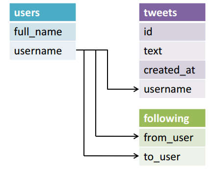

# Databases

## What is relational database?

Refer [this](https://code.tutsplus.com/tutorials/relational-databases-for-dummies--net-30244) article to read the source from which this section has been written.

A database stores data in an organized way so that it can be searched and retrieved later. It should contain one or more tables. A table is much like a spreadsheet, in that it's made up of rows and columns. All rows have the same columns, and each column contains the data itself. If it helps, think of your tables in the same way that you would a table in Excel.


Data can be inserted, retrieved, updated, and deleted from a table. The word, created, is generally used instead of inserted, so, collectively, these four functions are affectionately abbreviated as CRUD.

A relational database is a type of database that organizes data into tables, and links them, based on defined relationships. These relationships enable you to retrieve and combine data from one or more tables with a single **query**.

Let's get some Twitter data

| full_name             | username          | text                                                                                                                                               | created_at                        | following_username                 |
|-----------------------|-------------------|----------------------------------------------------------------------------------------------------------------------------------------------------|-----------------------------------|------------------------------------|
| Boris Hadjur        | _DreamLead      | What do you think about #emailing #campaigns #traffic in #USA? Is it a good market nowadays? do you have #databases?                             | Tue, 12 Feb 2013 08:43:09 +0000 | Scootmedia, MetiersInternet    |
| Gunnar Svalander    | GunnarSvalander | Bill Gates Talks Databases, Free Software on Reddit https://t.co/ShX4hZlA #billgates #databases                                                  | Tue, 12 Feb 2013 07:31:06 +0000 | klout, zillow                  |
| GE Software         | GEsoftware      | RT @KirkDBorne: Readings in #Databases: excellent reading list, many categories: http://t.co/S6RBUNxq  via @rxin Fascinating.                    | Tue, 12 Feb 2013 07:30:24 +0000 | DayJobDoc, byosko              |
| Adrian Burch        | adrianburch     | RT @tisakovich: @NimbusData at the @Barclays Big Data conference in San Francisco today, talking #virtualization, #databases, and #flash memory. | Tue, 12 Feb 2013 06:58:22 +0000 | CindyCrawford, Arjantim        |
| Andy Ryder          | AndyRyder5      | http://t.co/D3KOJIvF article about Madden 2013 using AI to prodict the super bowl #databases #bus311                                             | Tue, 12 Feb 2013 05:29:41 +0000 | MichaelDell, Yahoo             |
| Andy Ryder          | AndyRyder5      | http://t.co/rBhBXjma an article about privacy settings and facebook #databases #bus311                                                           | Tue, 12 Feb 2013 05:24:17 +0000 | MichaelDell, Yahoo             |
| Brett Englebert     | Brett_Englebert | #BUS311 University of Minnesota's NCFPD is creating #databases to prevent food fraud. http://t.co/0LsAbKqJ                                     | Tue, 12 Feb 2013 01:49:19 +0000 | RealSkipBayless, stephenasmith |
| Brett Englebert       | Brett_Englebert | #BUS311 companies might be protecting their production #databases, but what about their backup files? http://t.co/okJjV3Bm                       | Tue, 12 Feb 2013 01:31:52 +0000 | RealSkipBayless, stephenasmith |
| Nimbus Data Systems | NimbusData      | @NimbusData CEO @tisakovich @BarclaysOnline Big Data conference in San Francisco today, talking #virtualization, #databases,&amp; #flash memory  | Mon, 11 Feb 2013 23:15:05 +0000 | dellock6, rohitkilam           |
| SSWUG.ORG           | SSWUGorg        | Don't forget to sign up for our FREE expo this Friday: #Databases, #BI, and #Sharepoint: What You Need to Know! http://t.co/Ijrqrz29             | "Mon, 11 Feb 2013 22:15:37 +0000" | "drsql", "steam_games"
|

Usig the above data structure has pros and cons:

* 👍 The data is all in one place; so it's easy to find.
* ❌ The "username" and "following_username" columns are repetitive
* ❌ @AndyRyder5 and @Brett_Englebert each tweeted twice, so the rest of their information has been duplicated.

Duplicates are problematic because it makes the CRUD operations more challenging

### Remove Repetitive Data Across Columns

Let's improve on the above table design by splitting it up into two tables: one just for the following relationships and one for the rest of the information.

The followings table

| from_user       | to_user         |
|-----------------|-----------------|
| _DreamLead      | Scootmedia      |
| _DreamLead      | MetiersInternet |
| GunnarSvalander | klout           |
| GunnarSvalander | zillow          |
| GEsoftware      | DayJobDoc       |
| GEsoftware      | byosko          |
| adrianburch     | CindyCrawford   |
| adrianburch     | Arjantim        |
| AndyRyder       | MichaelDell     |
| AndyRyder       | Yahoo           |
| Brett_Englebert | RealSkipBayless |
| Brett_Englebert | stephenasmith   |
| NimbusData      | dellock6        |
| NimbusData      | rohitkilam      |
| SSWUGorg        | drsql           |
| SSWUGorg        | steam_games     |


The users table

| full_name             | username          | text                                                                                                                                               | created_at                        |
|-----------------------|-------------------|----------------------------------------------------------------------------------------------------------------------------------------------------|-----------------------------------|
| Boris Hadjur        | _DreamLead      | What do you think about #emailing #campaigns #traffic in #USA? Is it a good market nowadays? do you have #databases?                             | Tue, 12 Feb 2013 08:43:09 +0000 |
| Gunnar Svalander    | GunnarSvalander | Bill Gates Talks Databases, Free Software on Reddit http://t.co/ShX4hZlA #billgates #databases                                                   | Tue, 12 Feb 2013 07:31:06 +0000 |
| GE Software         | GEsoftware      | RT @KirkDBorne: Readings in #Databases: excellent reading list, many categories: http://t.co/S6RBUNxq  via @rxin Fascinating.                    | Tue, 12 Feb 2013 07:30:24 +0000 |
| Adrian Burch        | adrianburch     | RT @tisakovich: @NimbusData at the @Barclays Big Data conference in San Francisco today, talking #virtualization, #databases, and #flash memory. | Tue, 12 Feb 2013 06:58:22 +0000 |
| Andy Ryder          | AndyRyder5      | http://t.co/D3KOJIvF article about Madden 2013 using AI to prodict the super bowl #databases #bus311                                             | Tue, 12 Feb 2013 05:29:41 +0000 |
| Andy Ryder          | AndyRyder5      | http://t.co/rBhBXjma an article about privacy settings and facebook #databases #bus311                                                           | Tue, 12 Feb 2013 05:24:17 +0000 |
| Brett Englebert     | Brett_Englebert | #BUS311 University of Minnesota's NCFPD is creating #databases to prevent food fraud. http://t.co/0LsAbKqJ                                     | Tue, 12 Feb 2013 01:49:19 +0000 |
| Brett Englebert       | Brett_Englebert | #BUS311 companies might be protecting their production #databases, but what about their backup files? http://t.co/okJjV3Bm                       | Tue, 12 Feb 2013 01:31:52 +0000 |
| Nimbus Data Systems | NimbusData      | @NimbusData CEO @tisakovich @BarclaysOnline Big Data conference in San Francisco today, talking #virtualization, #databases,&amp; #flash memory  | Mon, 11 Feb 2013 23:15:05 +0000 |
| SSWUG.ORG           | SSWUGorg        | Don't forget to sign up for our FREE expo this Friday: #Databases, #BI, and #Sharepoint: What You Need to Know! http://t.co/Ijrqrz29             | "Mon, 11 Feb 2013 22:15:37 +0000" |

### Remove Repetitive Data Across Rows

We need to pull out the tweets and place them in their own table.


| id | text                                                                                                                                               | created_at                        | username          |
|----|----------------------------------------------------------------------------------------------------------------------------------------------------|-----------------------------------|-------------------|
| 1  | What do you think about #emailing #campaigns #traffic in #USA? Is it a good market nowadays? do you have #databases?                             | Tue, 12 Feb 2013 08:43:09 +0000 | _DreamLead      |
| 2  | Bill Gates Talks Databases, Free Software on Reddit http://t.co/ShX4hZlA #billgates #databases                                                   | Tue, 12 Feb 2013 07:31:06 +0000 | GunnarSvalander |
| 3  | RT @KirkDBorne: Readings in #Databases: excellent reading list, many categories: http://t.co/S6RBUNxq  via @rxin Fascinating.                    | Tue, 12 Feb 2013 07:30:24 +0000 | GEsoftware      |
| 4  | RT @tisakovich: @NimbusData at the @Barclays Big Data conference in San Francisco today, talking #virtualization, #databases, and #flash memory. | Tue, 12 Feb 2013 06:58:22 +0000 | adrianburch     |
| 5  | http://t.co/D3KOJIvF article about Madden 2013 using AI to prodict the super bowl #databases #bus311                                             | Tue, 12 Feb 2013 05:29:41 +0000 | AndyRyder5      |
| 6  | http://t.co/rBhBXjma an article about privacy settings and facebook #databases #bus311                                                           | Tue, 12 Feb 2013 05:24:17 +0000 | AndyRyder5      |
| 7  | #BUS311 University of Minnesota's NCFPD is creating #databases to prevent food fraud. http://t.co/0LsAbKqJ                                     | Tue, 12 Feb 2013 01:49:19 +0000 | Brett_Englebert |
| 8  | #BUS311 companies might be protecting their production #databases, but what about their backup files? http://t.co/okJjV3Bm                       | Tue, 12 Feb 2013 01:31:52 +0000 | Brett_Englebert |
| 9  | @NimbusData CEO @tisakovich @BarclaysOnline Big Data conference in San Francisco today, talking #virtualization, #databases,&amp; #flash memory  | Mon, 11 Feb 2013 23:15:05 +0000 | NimbusData      |
| 10 | Don't forget to sign up for our FREE expo this Friday: #Databases, #BI, and #Sharepoint: What You Need to Know! http://t.co/Ijrqrz29             | Mon, 11 Feb 2013 22:15:37 +0000 | SSWUGorg
|


The new users table

| full_name             | username          |
|-----------------------|-------------------|
| Boris Hadjur        | _DreamLead      |
| Gunnar Svalander    | GunnarSvalander |
| GE Software         | GEsoftware      |
| Adrian Burch        | adrianburch     |
| Andy Ryder          | AndyRyder5      |
| Brett Englebert     | Brett_Englebert |
| Nimbus Data Systems | NimbusData      |
| SSWUG.ORG           | SSWUGorg        |


So far, the original tweets table has been split into three new tables: **followings**, **tweets**, and **users**. But how is this useful? Repetitive data has been removed, but now the data is spread out across three independent tables. In order to retrieve the data, we need to draw meaningful links between the tables. This way we can express queries like, "what a user has tweeted and who a user is following".



### Structured Query Language (SQL)

SQL (Structured Query Language) is a database computer language designed for managing
data in relational database management systems (RDBMS).

What can SQL do?
* CRUD operations againt a given database
* Create new databases and tables
* SQL can set permissions on tables, procedures, and views

An **SQL query** is a statement representing some operation to perform in the database.


## Relational Database Service (RDS)

### Provision Postgres using RDS

[https://docs.aws.amazon.com/AmazonRDS/latest/UserGuide/CHAP_GettingStarted.CreatingConnecting.PostgreSQL.html](https://docs.aws.amazon.com/AmazonRDS/latest/UserGuide/CHAP_GettingStarted.CreatingConnecting.PostgreSQL.html)

### Create tables, insert and retrieve data

1. First, install the `psql` cli tool, which is the client for Postgres used from bash terminal

   ```shell
   sudo apt-get update
   sudo apt-get install postgresql-client
   ```
   
   Start Postgres shell by `psql postgres://<db-username>:<db-password>@<db-endpoint>:5432`

2. Create a database in Postgres (drop previous is exists)
   ```shell
   DROP DATABASE IF EXISTS twitter_demo;
   CREATE DATABASE twitter_demo;
   ```
3. Switch to `twitter_demo` db by `\c twitter_demo`.
4. Create tables:
   ```text
   CREATE TABLE users (
   full_name VARCHAR(100),
   username VARCHAR(100) PRIMARY KEY
   );
   
   CREATE TABLE follows (
   from_user VARCHAR(100),
   to_user VARCHAR(100)
   );
   
   CREATE TABLE tweets (
   id SERIAL,
   username VARCHAR(100),
   text VARCHAR(500),
   created_at DATE NOT NULL DEFAULT CURRENT_DATE
   );
   ```

5. Insert data
   ```text
   INSERT INTO users (full_name, username) VALUES ('Boris Hadjur', '_DreamLead');
   INSERT INTO users (full_name, username) VALUES ('Gunnar Svalander', 'GunnarSvalander');
   INSERT INTO users (full_name, username) VALUES ('GE Software', 'GEsoftware');
   INSERT INTO users (full_name, username) VALUES ('Adrian Burch', 'adrianburch');
   INSERT INTO users (full_name, username) VALUES ('Andy Ryder', 'AndyRyder5');
   INSERT INTO users (full_name, username) VALUES ('Brett Englebert', 'Brett_Englebert');
   INSERT INTO users (full_name, username) VALUES ('Nimbus Data Systems', 'NimbusData');
   INSERT INTO users (full_name, username) VALUES ('SSWUG.ORG', 'SSWUGorg');
   
   
   INSERT INTO follows (from_user, to_user) VALUES ('_DreamLead', 'Scootmedia');
   INSERT INTO follows (from_user, to_user) VALUES ('_DreamLead', 'MetiersInternet');
   INSERT INTO follows (from_user, to_user) VALUES ('GunnarSvalander', 'klout');
   INSERT INTO follows (from_user, to_user) VALUES ('GunnarSvalander', 'zillow');
   INSERT INTO follows (from_user, to_user) VALUES ('GEsoftware', 'DayJobDoc');
   INSERT INTO follows (from_user, to_user) VALUES ('GEsoftware', 'byosko');
   INSERT INTO follows (from_user, to_user) VALUES ('adrianburch', 'CindyCrawford');
   INSERT INTO follows (from_user, to_user) VALUES ('adrianburch', 'Arjantim');
   INSERT INTO follows (from_user, to_user) VALUES ('AndyRyder', 'MichaelDell');
   INSERT INTO follows (from_user, to_user) VALUES ('AndyRyder', 'Yahoo');
   INSERT INTO follows (from_user, to_user) VALUES ('Brett_Englebert', 'RealSkipBayless');
   INSERT INTO follows (from_user, to_user) VALUES ('Brett_Englebert', 'stephenasmith');
   INSERT INTO follows (from_user, to_user) VALUES ('NimbusData', 'dellock6');
   INSERT INTO follows (from_user, to_user) VALUES ('NimbusData', 'rohitkilam');
   INSERT INTO follows (from_user, to_user) VALUES ('SSWUGorg', 'drsql');
   INSERT INTO follows (from_user, to_user) VALUES ('SSWUGorg', 'steam_games');
   
   
   INSERT INTO tweets (text, created_at, username) VALUES ('What do you think about #emailing #campaigns #traffic in #USA? Is it a good market nowadays? do you have #databases?',	'Tue, 12 Feb 2013 08:43:09 +0000', '_DreamdLead');
   INSERT INTO tweets (text, created_at, username) VALUES ('Bill Gates Talks Databases, Free Software on Reddit http://t.co/ShX4hZlA #billgates #databases', 'Tue, 12 Feb 2013 07:31:06 +0000', 'MetiersInternet');
   INSERT INTO tweets (text, created_at, username) VALUES ('RT @KirkDBorne: Readings in #Databases: excellent reading list, many categories: http://t.co/S6RBUNxq via @rxin Fascinating.',	'Tue, 12 Feb 2013 07:30:24 +0000', 'GEsoftware');
   INSERT INTO tweets (text, created_at, username) VALUES ('RT @tisakovich: @NimbusData at the @Barclays Big Data conference in San Francisco today, talking #virtualization, #databases, and #flash memory.',	'Tue, 12 Feb 2013 06:58:22 +0000', 'adrianburch');
   INSERT INTO tweets (text, created_at, username) VALUES ('http://t.co/D3KOJIvF article about Madden 2013 using AI to prodict the super bowl #databases #bus311',	'Tue, 12 Feb 2013 05:29:41 +0000', 'MetiersInternet');
   INSERT INTO tweets (text, created_at, username) VALUES ('http://t.co/rBhBXjma an article about privacy settings and facebook #databases #bus311', 'Tue, 12 Feb 2013 05:24:17 +0000'	,'AndyRyder5');
   INSERT INTO tweets (text, created_at, username) VALUES ('#BUS311 University of Minnesotas NCFPD is creating #databases to prevent food fraud. http://t.co/0LsAbKqJ', 'Tue, 12 Feb 2013 01:49:19 +0000', 'Brett_Englebert');
   INSERT INTO tweets (text, created_at, username) VALUES ('#BUS311 companies might be protecting their production #databases, but what about their backup files? http://t.co/okJjV3Bm', 'Tue, 12 Feb 2013 01:31:52 +0000', 'Scootmedia');
   INSERT INTO tweets (text, created_at, username) VALUES ('@NimbusData CEO @tisakovich @BarclaysOnline Big Data conference in San Francisco today, talking #virtualization, #databases,& #flash memory', 'Mon, 11 Feb 2013 23:15:05 +0000', 'NimbusData');
   INSERT INTO tweets (text, created_at, username) VALUES ('Dont forget to sign up for our FREE expo this Friday: #Databases, #BI, and #Sharepoint: What You Need to Know! http://t.co/Ijrqrz29',	'Mon, 11 Feb 2013 22:15:37 +0000', 'SSWUGorg');
   ```
   
6. Retrieve some data  
   * Joint table of all users, and all followings for each user:
     ```shell
     SELECT * FROM users JOIN follows ON users.username=follows.from_user;
     ```
   * The tweets of all users that are followed by the user *_DreamLead*:
     ```text     
     SELECT to_user, text, created_at
     FROM users u
     JOIN follows f
     ON u.username=f.from_user
     JOIN tweets t
     ON f.to_user=t.username
     WHERE u.username='_DreamLead';
     ```
   * Use aggregation
     ```text
     SELECT to_user, COUNT(*) as tweets_count
     FROM users u
     JOIN follows f
     ON u.username=f.from_user
     JOIN tweets t
     ON f.to_user=t.username
     WHERE u.username='_DreamLead'
     GROUP BY to_user;
     ```
     
### Monitoring and alerting for an RDS database

1. Open the CloudWatch console at [https://console\.aws\.amazon\.com/cloudwatch/](https://console.aws.amazon.com/cloudwatch/)\.

2. In the navigation pane, choose **Alarms**, **All alarms**\.

3. Choose **Create alarm**\.

4. On the **Specify metric and conditions** page, choose **Select metric**\.

5. In the search box, enter the name of your RDS database and press Enter\.

6. Choose **RDS**, **Per\-Database Metrics**\.

7. In the search box, enter **IOPS** and press Enter, then select **ReadIOPS** and **WriteIOPS** metrics. The graph will show both read and write i/o operations metric for your db.

8. We would like to base the alarm on the total sum of read + write i/o. From **Add math**, choose **All functions**, **SUM**\.  

9. Choose the **Graphed metrics** tab, and edit the details for **Expression1** to **TotalIOPS**\.

10. Change the **Period** to **1 minute**\.

11. Clear selection from all metrics except for **TotalIOPS**\.

12. Choose **Select metric**\.

13. On the **Specify metric and conditions** page, enter a number of IOPS in **Define the threshold value**\.
For this tutorial, enter **100**. You can adjust this value for your workload requirements\.

14. Choose **Next**, and the **Configure actions** page appears\.

15. Keep **In alarm** selected, choose **Create new topic**, and enter the topic name and a valid email address\.  

16. Choose **Create topic**, and then choose **Next**\.

17. On the **Add name and description** page, enter the **Alarm name** and **Alarm description**, and then choose **Next**\.  

18. Preview the alarm that you're about to create on the **Preview and create** page, and then choose **Create alarm**\.

#### Testing your alarm

It is very important to test all the alarms you set, in production environment if possible. 

19. Connect to an Amazon Linux EC2 instance in the same region of your DB instance.
20. Install PostgreSQL tooling package by
```
sudo yum install postgresql-server postgresql-contrib
```
21. Perform a load test of your server and watch the alarm in action
To initialize test tables, execute first:
```shell
PGPASSWORD=<password> pgbench -i -U postgres -h <db-url> <internal-db-name>
```
Then run the full test by:
```shell
PGPASSWORD=<password> pgbench -P 10 -t 10000 -j 10 -c 10 -U postgres -h <db-url> <internal-db-name>
```
While `<password>` is you db password. `<db-url>` is you RDS database url and `<internal-db-name>` is an existed table. 

For more information on the `pgbench` command, read [here](https://www.postgresql.org/docs/current/pgbench.html).

## DynamoDB - Demo I - Basics + Lambda function

### Create a table

1. Open the DynamoDB console at [https://console.aws.amazon.com/dynamodb/](https://console.aws.amazon.com/dynamodb/)
2. In the navigation pane on the left side of the console, choose **Dashboard**.
3. On the right side of the console, choose **Create Table**.
4. Enter the table details as follows:
   1. For the table name, enter a unique table name.
   2. For the partition key, enter `Artist`.
   3. Enter `SongTitle` as the sort key.
   4. Choose **Customize settings**.
   5. On **Read/write capacity settings** choose **Provisioned** mode with autoscale capacity with a minimum capacity of **1** and maximum of **10**.
5. Choose **Create** to create the table.

### Write and read data


1. On DynamoDB web console page, choose **PartiQL editor** on the left side menu.
2. The following example creates several new items in the `<table-name>` table. The [PartiQL](https://docs.aws.amazon.com/amazondynamodb/latest/developerguide/ql-reference.html) is
   a SQL-compatible query language for DynamoDB.

```shell
INSERT INTO "<table-name>" VALUE {'Artist':'No One You Know','SongTitle':'Call Me Today', 'AlbumTitle':'Somewhat Famous', 'Awards':'1'}

INSERT INTO "<table-name>" VALUE {'Artist':'No One You Know','SongTitle':'Howdy', 'AlbumTitle':'Somewhat Famous', 'Awards':'2'}

INSERT INTO "<table-name>" VALUE {'Artist':'Acme Band','SongTitle':'Happy Day', 'AlbumTitle':'Songs About Life', 'Awards':'10'}
                            
INSERT INTO "<table-name>" VALUE {'Artist':'Acme Band','SongTitle':'PartiQL Rocks', 'AlbumTitle':'Another Album Title', 'Awards':'8'}
```

Query the data by

```shell
SELECT * FROM "<table-name>" WHERE Artist='Acme Band' AND SongTitle='Happy Day'
```

### Create and query a global secondary index

1. In the navigation pane on the left side of the console, choose **Tables**.
2. Choose your table from the table list.
3. Choose the **Indexes** tab for your table.
4. Choose **Create** index.
5. For the **Partition key**, enter `AlbumTitle`.
6. For **Index** name, enter `AlbumTitle-index`.
7. Leave the other settings on their default values and choose **Create** index.

8. You query the global secondary index through PartiQL by using the Select statement and providing the index name
```shell
SELECT * FROM "<table-name>"."AlbumTitle-index" WHERE AlbumTitle='Somewhat Famous'
```


### Process new items with DynamoDB Streams and Lambda

#### Enable Streams

1. In the navigation pane on the left side of the console, choose **Tables**.
2. Choose your table from the table list.
3. Choose the **Exports and streams** tab for your table.
4. Under **DynamoDB stream details** choose **Enable**.
5. Choose **New and old images** and click **Enable stream**.

#### Create Lambda execution IAM role

1. Open the IAM console at [https://console\.aws\.amazon\.com/iam/](https://console.aws.amazon.com/iam/)\.

2. In the navigation pane, choose **Roles**, **Create role**\.

3. On the **Trusted entity type** page, choose **AWS service** and the **Lambda** use case\.

4. On the **Review** page, enter a name for the role and choose **Create role**\.
5. Edit your IAM role with the following inline policy
```json
{
    "Version": "2012-10-17",
    "Statement": [
        {
            "Effect": "Allow",
            "Action": "lambda:InvokeFunction",
            "Resource": "arn:aws:lambda:<region>:<accountID>:function:<lambda-func-name>*"
        },
        {
            "Effect": "Allow",
            "Action": [
                "logs:CreateLogGroup",
                "logs:CreateLogStream",
                "logs:PutLogEvents"
            ],
            "Resource": "arn:aws:logs:<region>:<accountID>:*"
        },
        {
            "Effect": "Allow",
            "Action": [
                "dynamodb:DescribeStream",
                "dynamodb:GetRecords",
                "dynamodb:GetShardIterator",
                "dynamodb:ListStreams"
            ],
            "Resource": "arn:aws:dynamodb:<region>:<accountID>:table/<dynamo-table-name>/stream/*"
        },
        {
            "Effect": "Allow",
            "Action": [
                "sns:Publish"
            ],
            "Resource": [
                "*"
            ]
        }
    ]
}
```

Change the following placeholders to the appropriate values: `<region>`, `<accountID>`, `<dynamo-table-name>`, `<lambda-func-name>`


The policy has four statements that allow your role to do the following:
+ Run a Lambda function. You create the function later in this tutorial\.
+ Access Amazon CloudWatch Logs\. The Lambda function writes diagnostics to CloudWatch Logs at runtime\.
+ Read data from the DynamoDB stream.
+ Publish messages to Amazon SNS\.

#### Create a Lambda Function

1. Open the [Functions page](https://console.aws.amazon.com/lambda/home#/functions) of the Lambda console\.

2. Choose **Create function**\.

3. Under **Basic information**, do the following:

   1. Enter **Function name**.

   2. For **Runtime**, confirm that **Node\.js 16\.x** is selected\.

   3. For **Permissions** use your created role.

4. Choose **Create function**\.
5. Enter your function, copy the content of `14_dynamodb_lambda_func/publishNewSong.js` and paste it in the **Code source**. Change `<TOPIC-ARN>` to your SNS topic ARN you created in the previous exercise.
6. Click the **Deploy** button.
7. On the same page, click **Add trigger** and choose your Dynamo table as a source trigger.
8. Test your Lambda function by creating new items in the Dynamo table and watch for new emails in your inbox.


## DynamoDB - Demo II - integrate Dynamo with the PolyBot

### Create a table

In this step, you create a Youtube Bot table in Amazon DynamoDB. The table should store **video** items in the following structure:
```json
{
  "chatId": "TelegramChatId",
  "videoId": "YouTubeVideoId",
  "url": "VideoWebPageUrl",
  "title": "VideoTitle"
}
```
Users can send `/myvideos` to the bot in order to retrieve a list their video searches.

Given the above schema, which attributes should represent primary and sort key? 

1. Sign in to the AWS Management Console and open the DynamoDB console at [https://console.aws.amazon.com/dynamodb/](https://console.aws.amazon.com/dynamodb/)
2. In the navigation pane on the left side of the console, choose **Dashboard**.
3. On the right side of the console, choose **Create Table**.
4. Enter the table details as follows:
   1. For the table name, enter a unique table name.
   2. For the partition key, enter `chatId`.
   3. Enter `videoId` as the sort key.
   4. Leave **Default settings** selected.
5. Choose **Create** to create the table.

### Send and retrieve data from the PolyBot

1. In the [PolyBot repository](https://github.com/alonitac/PolyBot.git), go to branch `save_user_data`.
2. Observe the code differences compared to branch `main`.
3. Compete the two TODOs in `bot.py`
   1. In **Use dynamo.put_item() to store user video** you should store in `item` dict in you Dynamo table. 
   2. In **Use dynamo.query() to retrieve user videos** you should retrieve all videos by `charId` and send the video `url`s to the user chat. 

#### Code reference

Store data:

```python
response = dynamo.put_item(
    Item=item,
    TableName='your-table',
)
```

Retrieve data:

```python
 response = dynamo.query(
     ExpressionAttributeValues={
         ':chatId': {
             'S': 'variable-containing-the-chat-id',
         },
     },
     KeyConditionExpression=f'chatId = :chatId',
     TableName='your-table',
 )
 
 for item in response['Items']:
     # send item url and title to client
 ```