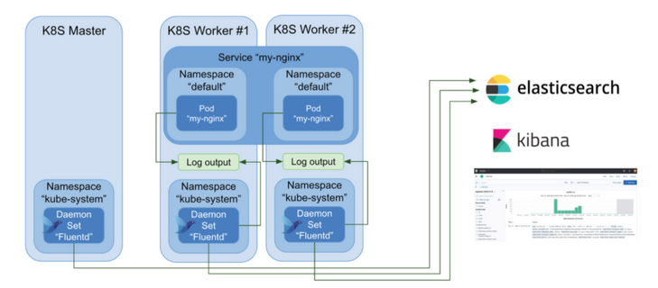

# Kubernetes Tutorials

## Install Minikube

[Minikube](https://kubernetes.io/docs/tasks/tools/#minikube) is a tool that lets you run Kubernetes locally.

Installation as well as starting a cluster instructions can be found here: https://minikube.sigs.k8s.io/docs/start/


## Install `kubectl`

1. Download the `kubectl` binary from [Kubernetes](https://kubernetes.io/docs/tasks/tools/install-kubectl-windows/#install-kubectl-binary-with-curl-on-windows) official site.

2. Put the `kubectl.exe` binary in a directory accessible in your PATH environment variable.

## Start K8S dashboard

Kubernetes Dashboard allows you to get easily acclimated to your new cluster.

1. Execute
```shell
minikube dashboard
```

2. To access the dashboard endpoint, open the printed link with a web browser.

# Kubernetes Tasks

The Kubernetes documentation contains pages that show how to do individual tasks.
During this module we will walk through core tasks. 

https://kubernetes.io/docs/tasks/

## Run a Stateless Application Using a Deployment

Follow:  
https://kubernetes.io/docs/tasks/run-application/run-stateless-application-deployment/

### Further reading and doing

#### Understanding [Kubernetes Objects](https://kubernetes.io/docs/concepts/overview/working-with-objects/kubernetes-objects/)

Almost every Kubernetes object includes a nested object that govern the object's configuration: the object `spec`.
The `spec` provides a description of the characteristics you want the resource to have: its **desired state**.

In the .yaml file for the Kubernetes object you want to create, you'll need to set values for the following fields:

- `apiVersion` - Which version of the Kubernetes API you're using to create this object.
- `kind` - What kind of object you want to create.
- `metadata` - Data that helps uniquely identify the object, including a name string, UID, and optional namespace.
- `spec` - What state you desire for the object.

**Labels** are key/value pairs that are attached to objects, such as Deployment.
Labels are intended to be used to specify identifying attributes of objects that are meaningful and relevant to users. E.g.:

- `"release" : "stable"`
- `"environment" : "dev"`
- `"tier" : "backend"`

Via a **Label Selector**, the client/user can identify a set of objects. 

#### Deploy your own app

1. Build a simple Flask webserver in a Docker container (can be found in `05_simple_webserver`).
2. Push the image to a **public** container registry (e.g. ERC).
3. Change the `deployment.yaml` manifest according to your image. 
4. Apply your changes.
5. You can use [`kubectl port-forward`](https://kubernetes.io/docs/tasks/access-application-cluster/port-forward-access-application-cluster/) command to forward specific pod and port to your local machine, so you can visit the app under the `localhost:<port>` address. This type of connection can be useful for pod debugging and obviously should not be used outside the borders of the development team.
   To do so, perform:

```shell
kubectl port-forward <pod-name> <local-port>:<pod-port> 
```

## Use Port Forwarding to Access Applications in a Cluster

Follow:  
https://kubernetes.io/docs/tasks/access-application-cluster/port-forward-access-application-cluster/

## Use a Service to Access an Application in the Cluster

Follow:   
https://kubernetes.io/docs/tasks/access-application-cluster/service-access-application-cluster/

Notes: 

- _Using a service configuration file_ section (use YAML file instead `kubectl expose` command).
- Use `minikube ip` to get the IP of Minikube "node" and visit the app in `http://<NodeIP>:<NodePort>`


### Further reading and doing

Services can be exposed in different ways by specifying a `type` in the ServiceSpec. We will review two types:

- `ClusterIP` (default) - Exposes the Service on an internal IP in the cluster. This type makes the Service only reachable from within the cluster.
- `NodePort` - Exposes the Service on some port of each **Node** in the cluster. Makes a Service accessible from outside the cluster using `<NodeIP>:<NodePort>`.

## Assign Memory Resources to Containers and Pods

Follow:  
https://kubernetes.io/docs/tasks/configure-pod-container/assign-memory-resource/


## Assign CPU Resources to Containers and Pods

Follow: 
https://kubernetes.io/docs/tasks/configure-pod-container/assign-cpu-resource/


## Configure Liveness, Readiness and Startup Probes

Follow:  
https://kubernetes.io/docs/tasks/configure-pod-container/configure-liveness-readiness-startup-probes/

> The following sections can be skipped:  
> - Define a TCP liveness probe
> - Define a gRPC liveness probe
> - Use a named port
> - Protect slow starting containers with startup probes

### Further reading and doing

Under `21_k8s/zero-downtime-deployment-demo` you will find a simple Flask webserver. 

1. User Docker and ECR (or Nexus, or DockerHub) to build and push the app according to the Dockerfile.
2. In `deployment.yaml` change the Deployment `image:` according to your image URI.
3. Apply your changes.
4. Generate some load on your app by:

`kubectl run -i --tty load-generator --rm --image=busybox:1.28 --restart=Never -- /bin/sh -c "while sleep 0.2; do (wget -q -O- http://simaple-webserver-service:8080 &); done"`

5. During the load test, perform a rolling update to a new version of the app (new built Docker image). Change the Python code so it can be seen clearly when you are responded from the new app version. e.g. return `Hello world 2` instead of `Hello world`.
6. Observe how during rolling update, some requests are failing.
7. Use the `/ready` endpoint and add a `readinessProbe` to gain zero-downtime rolling update, which means, all user requests are being served, even during the update. 


## Configure a Pod to Use a Volume for Storage

Follow:  
https://kubernetes.io/docs/tasks/configure-pod-container/configure-volume-storage/

### Further reading and doing

- Familiarize yourself with the material in [Volumes](https://kubernetes.io/docs/concepts/storage/volumes/)
- [Communicate Between Containers in the Same Pod Using a Shared Volume](https://kubernetes.io/docs/tasks/access-application-cluster/communicate-containers-same-pod-shared-volume/)


## Configure a Pod to Use a PersistentVolume for Storage

Follow:  
https://kubernetes.io/docs/tasks/configure-pod-container/configure-persistent-volume-storage/

## Distribute Credentials Securely Using Secrets

Follow:  
https://kubernetes.io/docs/tasks/inject-data-application/distribute-credentials-secure/


## ConfigMap

In this demo we will deploy MySQL server in Kuberenetes cluster using Deployment. 

All Yaml files are under `21_k8s/mysql-configmap-secret-demo`.


1. Create a Secret object containing the root username password for MySQL

`kubectl apply -f mysql-secret.yaml`

2. Deploy the MySQL deployment by applying `mysql-deployment.yaml` configuration file.

Now let's say we want to allow maximum of 50 connection to our DB. We would like to find a useful way to "inject" this config to our pre-built `mysql:5.7` image (we surely don't want to build the MySQL image ourselves). 
For that, the [ConfigMap](https://kubernetes.io/docs/concepts/configuration/configmap/) object can assist.
In the `mysql` Docker image, custom configurations for the MySQL server can be placed in `/etc/mysql/mysql.conf.d` directory, any file ends with `.cnf` under that directory, will be applied as an additional configurations to MySQL. But how can we "insert" a custom file to the image? keep reading...

5. Review the ConfigMap object under `mysql-config.yaml`. And apply it.
6. Comment **in** the two snippets in `mysql-deployment.yaml` and apply the changes. 
7. Make sure the new configurations applied.


### Further reading and doing

https://kubernetes.io/docs/tasks/configure-pod-container/configure-pod-configmap

## Run a Single-Instance Stateful Application

Follow:  
https://kubernetes.io/docs/tasks/run-application/run-single-instance-stateful-application/

## Run a Replicated Stateful Application

Follow:
https://kubernetes.io/docs/tasks/run-application/run-replicated-stateful-application/

## HorizontalPodAutoscaler Walkthrough

Follow:  
https://kubernetes.io/docs/tasks/run-application/horizontal-pod-autoscale-walkthrough/

## Running Automated Tasks with a CronJob

Follow:  
https://kubernetes.io/docs/tasks/job/automated-tasks-with-cron-jobs/


### Further reading and doing 

- https://kubernetes.io/docs/concepts/workloads/controllers/cron-jobs/

## Helm

Helm is the package manager for Kubernetes.
The main big 3 concepts of helm are:

- A **Chart** is a Helm package. It contains all the resource definitions necessary to run an application, tool, or service inside of a Kubernetes cluster.
- A **Repository** is the place where charts can be collected and shared.
- A **Release** is an instance of a chart running in a Kubernetes cluster.

[Install](https://helm.sh/docs/intro/install/) the Helm cli if you don't have.

You can familiarize yourself with this tool using [Helm docs](https://helm.sh/docs/intro/using_helm/). 

### Deploy MySQL using Helm

How relational databases are deployed in real-life applications?

The following diagram shows a Multi-AZ DB cluster.


With a Multi-AZ DB cluster, MySQL replicates data from the writer DB instance to both of the reader DB instances.
When a change is made on the writer DB instance, it's sent to each reader DB instance.
Acknowledgment from at least one reader DB instance is required for a change to be committed.
Reader DB instances act as automatic failover targets and also serve read traffic to increase application read throughput.

Once you have Helm ready, you can add a chart repository. Check [Artifact Hub](https://artifacthub.io/packages/search?kind=0). 

Let's review the Helm chart written by Bitnami for MySQL provisioning in k8s cluster.

[https://github.com/bitnami/charts/tree/master/bitnami/mysql/#installing-the-chart](https://github.com/bitnami/charts/tree/master/bitnami/mysql/#installing-the-chart)

1. Add the Bitnami Helm repo to your local machine:
```shell
# or update if you have it already: `helm repo update bitnami`
helm repo add bitnami https://charts.bitnami.com/bitnami
```
2. First let's install the chart without any changes
```shell
# helm install <release-name> <repo-name>/<chart-name> 
helm install mysql bitnami/mysql
```

Whenever you install a chart, a new release is created. So one chart can be installed multiple times into the same cluster. And each can be independently managed and upgraded.

During installation, the helm client will print useful information about which resources were created, what the state of the release is, and also whether there are additional configuration steps you can or should take.

You can always type `helm list` to see what has been released using Helm.

Now we want to customize the chart according to our business configurations.
To see what options are configurable on a chart, use `helm show values bitnami/mysql` or even better, go to the chart documentation on GitHub. 

We will pass configuration data during the chart upgrade by specify a YAML file with overrides (`-f custom-values.yaml`). This can be specified multiple times and the rightmost file will take precedence.

3. Review `mysql-helm/values.yaml`, change values or [add parameters](https://github.com/bitnami/charts/tree/master/bitnami/mysql/#parameters) according to your need.
4. Upgrade the `mysql` chart by
```shell
helm upgrade -f mysql-helm/values.yaml mysql bitnami/mysql
```

An upgrade takes an existing release and upgrades it according to the information you provide. Because Kubernetes charts can be large and complex, Helm tries to perform the least invasive upgrade. It will only update things that have changed since the last release.

If something does not go as planned during a release, it is easy to roll back to a previous release using `helm rollback [RELEASE] [REVISION]`:

```shell
helm rollback mysql 1
```

5. To uninstall this release:
```shell
helm uninstall mysql
```

## Stream Pod logs to Elasticsearch databases using FluentD

### Fluentd introduced

[Fluentd](https://www.fluentd.org/) is an open source data collector for unified logging layer.
Fluent allows you to unify data collection and consumption for a better use and understanding of data.

Here is an illustration of how Fluent works in the k8s cluster:



Fluentd runs in the cluster as a [DaemonSet](https://kubernetes.io/docs/concepts/workloads/controllers/daemonset/). A DaemonSet ensures that all **nodes** run a copy of a **pod**. That way, Fluentd can collect log information from every containerized applications easily in each k8s node.

We will deploy the Fluentd chart to collect containers logs to send them to [Elasticsearch](https://www.elastic.co/what-is/elasticsearch) database.

1. Visit the Fluentd Helm chart at https://github.com/fluent/helm-charts/tree/main/charts/fluentd
2. Add the helm repo
```shell
# or update if you have it already: `helm repo update fluent`
helm repo add fluent https://fluent.github.io/helm-charts
```

3. Install the Fluentd chart by:
```shell
helm install fluentd fluent/fluentd
```

4. Watch and inspect the running containers under **Workloads** -> **DaemonSet**. Obviously, it doesn't work, as Fluent need to talk to an existed Elasticsearch database.
5. Elasticsearch db can be provisioned by applying `elasticsearch.yaml`.
6. Create a YAML file called `fluentd-helm-values.yaml`. You should override the [following](https://github.com/fluent/helm-charts/blob/main/charts/fluentd/values.yaml#L379) default Helm values, by:
```yaml
fileConfigs:
  04_outputs.conf: |-
    <label @OUTPUT>
      <match **>
        @type elasticsearch
        host "<elasticsearch-host>"
        logstash_format true
        port <elasticsearch-port>
      </match>
    </label>
```
While replacing `<elasticsearch-host>` and `<elasticsearch-port>` with the hostname of Elasticsearch int the cluster.
7. Finally, upgrade the `fluentd` release by `helm upgrade -f elastic-fluent/fluentd-helm-values.yaml fluentd fluent/fluentd`


### Visualize logs with Grafana

1. Review the objects in `grafana.yaml` and apply.
2. Visit grafana service (default username and password is `admin`) and configure the Elasticsearch database to view all cluster logs.


### Fluentd permissions in the cluster

Have you wondered how does the Fluentd pods have access to other pods logs!?

This is a great point to learn something about k8s role and access control mechanism ([RBAC](https://kubernetes.io/docs/reference/access-authn-authz/rbac/)).

#### Role and ClusterRole

_Role_ or _ClusterRole_ contains rules that represent a set of permissions on the cluster (e.g. This Pod can do that action..).
A Role always sets permissions within a particular _namespace_
ClusterRole, by contrast, is a non-namespaced resource.

#### Service account

A _Service Account_ provides an identity for processes that run in a Pod.
When you create a pod, if you do not specify a service account, it is automatically assigned the `default` service account in the same namespace.

#### RoleBinding and ClusterRoleBinding

A role binding grants the permissions defined in a role to a user or set of users.
A RoleBinding may reference any Role in the same namespace. Alternatively, a RoleBinding can reference a ClusterRole and bind that ClusterRole to the namespace of the RoleBinding.

---

Observe the service account used by the fluentd Pods, observe their ClusterRole bound to them.


## Elastic Kubernetes Service (EKS)

Follow the below docs to create a cluster using the management console:  
https://docs.aws.amazon.com/eks/latest/userguide/create-cluster.html

In order to connect to an EKS cluster, you should execute the following `aws` command from your local machine:

```shell
aws eks --region <region> update-kubeconfig --name <cluster_name>
```

Change `<region>` and `<cluster_name>` accordingly.


### Deploy the k8s dashboard in EKS

https://docs.aws.amazon.com/eks/latest/userguide/dashboard-tutorial.html

### Install Ingress and Ingress Controller on EKS

[Ingress](https://kubernetes.io/docs/concepts/services-networking/ingress/#what-is-ingress) exposes HTTP and HTTPS routes from outside the cluster to services within the cluster.
An Ingress may be configured to give Services externally-reachable URLs, load balance traffic, terminate SSL / TLS, and offer name-based virtual hosting.
In order for the **Ingress** resource to work, the cluster must have an **Ingress Controller** running.

Kubernetes as a project supports and maintains AWS, GCE, and [nginx](https://github.com/kubernetes/ingress-nginx) ingress controllers.

1. If working on a shared repo, create your own namespace by:
   ```shell
   kubectl create ns <my-ns-name>
   ```
2. Deploy the 2048 game app under `manifests/2048.yaml`, make sure you change `namespace: <your-namespace-here>` to your namespace name.
3. Deploy the Nginx ingres controller (done only once per cluster). Nginx ships with ready to use HELM charts or YAML manifests for many cloud providers. We will deploy the [Nginx ingress controller behind a Network Load Balancer](https://kubernetes.github.io/ingress-nginx/deploy/#aws). (why Network LB is preferred than Application LB?)

We want to access the 2048 game application from a domain such as http://test-2048.devops-int-college.com

4. Add a subdomain A record for the [devops-int-college.com](https://us-east-1.console.aws.amazon.com/route53/v2/hostedzones#ListRecordSets/Z02842682SGSPDJQMJGFT) domain (e.g. test-2048.devops-int-college.com). The record should have an alias to the NLB created by EKS after the ingress controller has been deployed.
5. Inspired by the manifests described in [Nginx ingress docs](https://kubernetes.github.io/ingress-nginx/user-guide/basic-usage/#basic-usage-host-based-routing), create and apply an Ingress resource such that when visiting your registered DNS, the 2048 game will be displayed on screen.

## Prometheus on K8S

[Prometheus](https://prometheus.io/docs/introduction/overview/) Prometheus is a monitoring platform that collects metrics from monitored targets by scraping metrics HTTP endpoints on these targets.
Prometheus is shipped with an extensive list of [exporters](https://prometheus.io/docs/instrumenting/exporters/). An exporter is a pluggable piece which allow Prometheus to collect metrics from other system (e.g. databases, cloud services, OS etc..). Some exporters are official, others developed by the community. 

Note: If using a shared k8s cluster, **deploy all resources in your own namespace**!

1. Deploy Prometheus using the [community Helm chart](https://github.com/prometheus-community/helm-charts/tree/main/charts/prometheus).
2. Deploy Grafana (either by Helm or by the manifest under `21_k8s/elastic-fluent/grafana.yaml`).
3. Connect to Grafana (you can utilize the installed Ingress controller or by `kubectl port-forward`).
4. Configure the Prometheus server as a data source. 
5. Import one of the following dashboards:
   - https://grafana.com/grafana/dashboards/6417-kubernetes-cluster-prometheus/
   - https://grafana.com/grafana/dashboards/315-kubernetes-cluster-monitoring-via-prometheus/
   - https://grafana.com/grafana/dashboards/12740-kubernetes-monitoring/
6. Deploy the [Prometheus Cloudwatch Exporter](https://github.com/prometheus-community/helm-charts/tree/main/charts/prometheus-cloudwatch-exporter).
7. Configure Prometheus to scrape metrics from Cloudwatch Exporter (you may find helpful values under `prometheus/values.yaml`).

