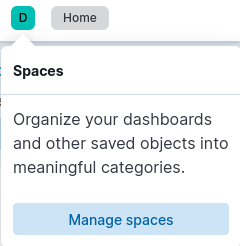
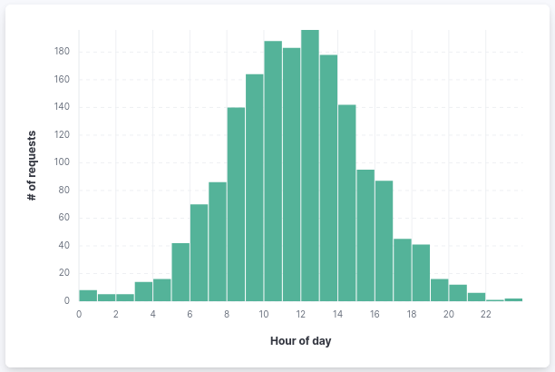
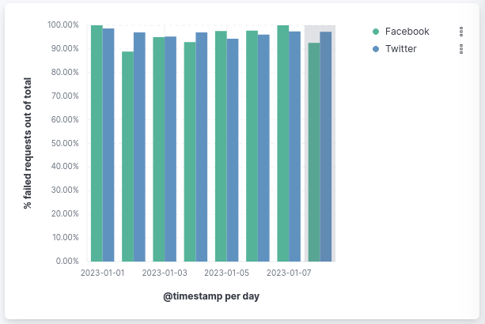
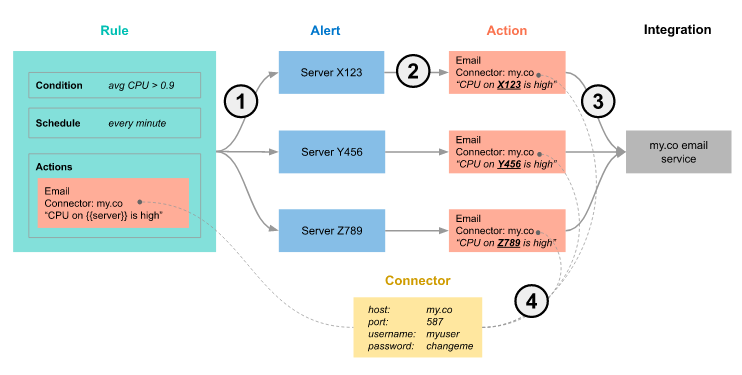
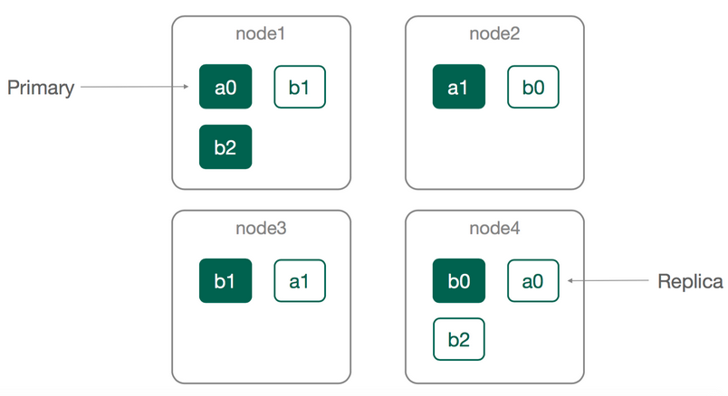

# The Elastic Stack (Elasticsearch, Logstash, Kibana)

Let's get yourself familiar with the ELK stack:

https://www.elastic.co/what-is/elk-stack

## Elasticsearch on K8S

**Note:** this chart should be released once per k8s cluster (the same server will be shared by all students).

https://bitnami.com/stack/elasticsearch/helm

Deploy with the following values:

```yaml
coordinating:
   replicaCount: 0 

ingest:
   enabled: false
   
global:
   kibanaEnabled: true
```

## Kibana setup

Visit Kibana by port-forwarding the service:

```shell
kubectl port-forward svc/<kibana-service> 5601:5601
```

Then go to `https://localhost:5601`.

Open the **Spaces** tooltip, and create your own namespace in which you will practice:



### Add the sample data

Sample data sets come with sample visualizations, dashboards, and more to help you explore before you ingest or add your own data.

1. On the home page, click *Try sample data*.
2. Click *Other sample data sets*.
3. On the *Sample web logs* card, click *Add data*.

## Kibana Query Language (KQL)

Before we are experimenting with KQL, read the following [important concepts of Kibana](https://www.elastic.co/guide/en/kibana/current/kibana-concepts-analysts.html).

Then, read [the KQL short tutorial](https://www.elastic.co/guide/en/kibana/current/kuery-query.html) from Elastic's official docs.

### Try it yourself

Open the **Kibana Sample Data Logs** data view under Discover page, and search for the following information: 

- Query all logs with response code 200 or 404 from the last 4 days.
- Query all successful requests from last day, referred from `twitter.com` 
- All non-successful requests (both by client or server side) 2023-01-05T00:00:00Z (which means UTC time).
- Search all documents where the `request` field contains the string `elasticsearch-6.3.2.deb` within the last 7 days.
- According to a bad system design, your platform has to block users from download large files (files larger than `9216` bytes \[9KB\]) during every day for 30 minutes. The product manager asks your insights regarding the hour in the day that you should apply this limitation. What hour will you advise?   

### Filters

- Create a [Filter](https://www.elastic.co/guide/en/kibana/current/kibana-concepts-analysts.html#autocomplete-suggestions) that displays data when `hour_of_day` value is between the working hours (`9-17`). 
- What is the maximum requested resource (highest `bytes` request) within the last 7 days, during working hours? Was it responded with `200` status code? 

## Kibana Dashboards

### Try it yourself - create a new dashboard

- Open the main menu, then click **Dashboard**.

- Click **Create dashboard**.

- Set the time filter to **Last 7 days**.

- On the dashboard, click **Create visualization**.

### Panel I: Unique visitors 

- Open the **Visualization type** dropdown, then select **Metric**.

- From the **Available fields** list, drag **clientip** to the workspace or layer pane.

In the layer pane, **Unique count of clientip** appears because the editor automatically applies the **Unique count** function to the **clientip** field (**Unique count** is the only numeric function that works with IP addresses).

- In the layer pane, click **Unique count of clientip**.

- In the **Name** field, enter `Unique visitors`.

- Click **Close**.

- Click **Save** to save the panel.

### Panel II: Outbound traffic over time

To visualize the **bytes** field over time:

- On the dashboard, click **Create visualization**.

- From the **Available fields** list, drag **bytes** to the workspace.

The visualization editor creates a bar chart with the **timestamp** and **Median of bytes** fields.

- To emphasize the change in **Median of bytes** over time, change the visualization type to **Line**.

- The default minimum time interval is 3 hour, but we would like to get a view over days. To increase the minimum time interval:

  - In the layer pane, click **timestamp**.

  - Change the **Minimum interval** to **1d**, then click **Close**.
  
- Click **Save and return**

### Panel III: Top requested pages 

We will create a visualization that displays the most frequent values of **request.keyword** on your website, ranked by the unique visitors.

- On the dashboard, click **Create visualization**.

- From the **Available fields** list, drag **clientip** to the **Vertical axis** field in the layer pane.

The visualization editor automatically applies the **Unique count** function.

- Drag **request.keyword** to the workspace.

Note: The chart labels are unable to display because the **request.keyword** field contains long text fields

- Open the **Visualization type** dropdown, then select **Table**.

- In the layer pane, click **Top 5 values of request.keyword**.

- In the **Number of values** field, enter `10`.

- In the **Name** field, enter `Page URL`.

- Click **Close**.

- Click **Save and return**.

### Panel IV: Classify request size

Create a proportional visualization that helps you determine if your users transfer more bytes from requests under 10KB versus over 10Kb.

- On the dashboard, click **Create visualization**.

- From the **Available fields** list, drag **bytes** to the **Vertical axis** field in the layer pane.

- In the layer pane, click **Median of bytes**.

- Click the **Sum** quick function, then click **Close**.

- From the **Available fields** list, drag **bytes** to the **Breakdown by** field in the layer pane.

- In the **Breakdown** layer pane, click **bytes**.

- Click **Create custom ranges**, enter the following in the **Ranges** field, then press Return:

    - **Ranges** &mdash; `0` -> `10240`
    
    - **Label** &mdash; `Below 10KB`

- Click **Add range**, enter the following, then press Return:

    - **Ranges** &mdash; `10240` -> `+∞`
    
    - **Label** &mdash; `Above 10KB`
    
- From the **Value format** dropdown, select **Bytes (1024)**, then click **Close**.

To display the values as a percentage of the sum of all values, use the **Pie** chart.

- Open the **Visualization Type** dropdown, then select **Pie**.

- Click **Save and return**.


### Panel V: Distribution of requests along the day

Create the following visualization:




### Panel VII: Website traffic sources

- On the dashboard, click **Create visualization**.

- Open the **Visualization type** dropdown, then select **Treemap**.

- From the **Available fields** list, drag **Records** to the **Size by** field in the layer pane.

- In the layer pane, click **Add or drag-and-drop a field** for **Group by**.

Create a filter for each website traffic source:

- Click **Filters**.

- Click **All records**, enter the following in the query bar, then press Return:

    - **KQL** - `referer : *facebook.com*`
    
    - **Label** - `Facebook`

- Click **Add a filter**, enter the following in the query bar, then press Return:

  - **KQL** - `referer : *twitter.com*`
    
  - **Label** - `Twitter`

- Click **Add a filter**, enter the following in the query bar, then press Return:

    - **KQL** - `NOT referer : *twitter.com* OR NOT referer: *facebook.com*`
    
    - **Label** - `Other`

- Click **Close**.

- Click **Save and return**.

### Panel VI: SLA (Service-level agreement)

Assume Facebook and Twitter are your two major customers, and your company agreed to serve 99% of the incoming requests originating from Facebook or Twitter. 

Create a visualization which calculates the SLA per client over a single day. The SLA is defined by the following formula:

```text
1 - [(# of failed requests)/(# of total requests)]
```

Failed requests are those with status code `>= 500`. 



Tip - use thew following custom formula:

```text
1 - (count(kql='response.keyword >= 500') / count(kql='response.keyword: *'))
```

## Kibana Alerting System

### Update the Helm chart to enable alerting

**Should be applied only once per cluster!!!**

Review and discuss the Helm values file under `22_elastic/elasticsearch-values.yaml`.

From now on, you should connect to Kibana either using `elastic` username (the password is stored as s secret in the cluster), or using your own created username. 

#### Alerts [Concepts and terminology](https://www.elastic.co/guide/en/kibana/current/alerting-getting-started.html#_concepts_and_terminology)

A **rule** specifies a background task that runs on the Kibana server to check for specific conditions.

A rule consists of three main parts:

  - Conditions: what needs to be detected?
  - Schedule: when/how often should detection checks run?
  - Actions: what happens when a condition is detected?



When checking for a condition, a rule might identify multiple occurrences of the condition. Kibana tracks each of these **alerts** separately and takes an **action** per alert.

**Connectors** provide a central place to store connection information for services and integrations.

1. Anytime a rule’s conditions are met, an alert is created. This example checks for servers with average CPU > 0.9. Three servers meet the condition, so three alerts are created.
2. Alerts create actions as long as they are not muted or throttled. When actions are created, the template that was setup in the rule is filled with actual values. In this example, three actions are created, and the template string {{server}} is replaced with the server name for each alert.
3. Kibana invokes the actions, sending them to a third party integration like an email service.
4. If the third party integration has connection parameters or credentials, Kibana will fetch these from the connector referenced in the action.

### Create alert

We will simulate an alert rule that will be triggered according to a custom log. 

The use case: **account deletion**.

Account deletion is a very sensitive and important operation that your system should perform well. If your system fails to delete an account whenever a given user is asking to do so, it has legal and security implications. 

Let's say that you want to be notified whenever your application fails to delete an accounts properly.

#### Simulate logs data

First we need to feed Elasticsearch db with some data to simulate the desired event.

1. In the Kibana main menu, go to **Management** -> **Dev Tools**. The Dev Tools allows you to execute queries directly again the Elasticsearch database. 
2. Create your own index and insert data into it:
```json
POST /<your-index-name>/_doc
{
  "@timestamp": "2099-01-15T12:49:07.000Z",
  "message": "account deletion failed",
  "event": {
    "dataset": "<your-index-name>"
  }
}
```
Change `<your-index-name>` to your index name. Change the timestamp according to your needs - at the end, the alert rule will search for logs that have been written recently. 

3. If you want to make sure your data has been successfully written, query all the records in your index:
```json 
GET /<your-index-name>/_search
```

4. Define your index as a data view. From the Kibana main menu, under **Management** -> **Stack Management**, choose **Data view** from the sub-menu and create a new data view.

#### Add your data to Observability Logs 

Observability Logs in Kibana enables you to search, filter, and tail all your logs ingested into Elasticsearch. There is live streaming of logs functionality, filtering using auto-complete, and a logs histogram for quick navigation.

We will build the alert rule based on logs data that is being fed into Observability Logs.

5. In the Kibana main menu, under **Observability** -> **Logs**, click **Settings** in the top-right bar.
6. In the settings page, add your index to the data feed.
7. Save and make sure that your data appears in the feed. 

#### Create the alert rule

8. Under **Observability** -> **Alert**, choose **Manage Rules**, and then **Create Rule**.
9. Follow the rule definition form, and create a rule of type **Log threshold** that will trigger alert when the message `account deletion failed` is being logged into your index.
10. Under Actions, choose either Index or Server log (will be discussed in class). 
11. Test the rule - trigger the alert.


## Elastic APM

https://www.elastic.co/guide/en/apm/get-started/7.15/components.html

https://www.elastic.co/guide/en/apm/agent/python/current/flask-support.html


### Backup and restore

https://www.elastic.co/guide/en/elasticsearch/reference/current/snapshot-restore.html

## Elasticsearch Database

Elastic architecture in a nutshell



### Cluster Nodes

Any time that you start an instance of Elasticsearch, you are starting a node. A collection of connected nodes is called a cluster.
Every node in the cluster can handle HTTP and transport traffic by default. The transport layer is used exclusively for communication between nodes; the HTTP layer is used by REST clients.

All nodes know about all the other nodes in the cluster and can forward client requests to the appropriate node.

#### Node types

- **Master node**: A node that has the master role, which makes it eligible to be elected as the master node, which controls the cluster.
- **Data node**: Data nodes hold data and perform data related operations such as CRUD, search, and aggregations.
- **Ingest node**: Ingest nodes are able to apply an ingest pipeline to a document in order to transform and enrich the document before indexing.
- **Coordinating node**: Requests like search requests or bulk-indexing requests may involve data held on different data nodes. A search request, for example, is executed in two phases which are coordinated by the node which receives the client request— the coordinating node.

The [official Elastic docs](https://www.elastic.co/guide/en/elasticsearch/reference/current/modules-node.html) contains a detailed list of all node types.

### Query DSL

#### Add data

You add data to Elasticsearch as JSON objects called documents. Elasticsearch stores these documents in searchable indices.

Submit the following indexing request to add a single log entry to the `logs-my_app-default` index:

```json lines
POST logs-my_app-default/_doc
{
  "@timestamp": "2099-05-06T16:21:15.000Z",
  "event": {
    "original": "192.0.2.42 - - [06/May/2099:16:21:15 +0000] \"GET /images/bg.jpg HTTP/1.0\" 200 24736"
  }
}
```
Use the `_bulk` endpoint to add multiple documents in one request.

```json lines
PUT logs-my_app-default/_bulk
{ "create": { } }
{ "@timestamp": "2099-05-07T16:24:32.000Z", "event": { "original": "192.0.2.242 - - [07/May/2020:16:24:32 -0500] \"GET /images/hm_nbg.jpg HTTP/1.0\" 304 0" } }
{ "create": { } }
{ "@timestamp": "2099-05-08T16:25:42.000Z", "event": { "original": "192.0.2.255 - - [08/May/2099:16:25:42 +0000] \"GET /favicon.ico HTTP/1.0\" 200 3638" } }
```

#### Search data

Indexed documents are available for search in near real-time.
The following search matches all log entries in `logs-my_app-default` and sorts them by `@timestamp` in descending order.

```json lines
GET logs-my_app-default/_search
{
  "query": {
    "match_all": { }
  },
  "sort": [
    {
      "@timestamp": "desc"
    }
  ]
}
```

Parsing the entire `_source` is unwanted for large documents. To exclude it from the response, set the `_source` parameter to `false`.
Instead, use the `fields` parameter to retrieve the fields you want.

```json lines
GET logs-my_app-default/_search
{
  "query": {
    "match_all": { }
  },
  "fields": [
    "@timestamp"
  ],
  "_source": false,
  "sort": [
    {
      "@timestamp": "desc"
    }
  ]
}
```

#### Search a date range

To search across a specific time or IP range, use a `range` query.

```json lines
GET logs-my_app-default/_search
{
  "query": {
    "range": {
      "@timestamp": {
        "gte": "2099-05-05",
        "lt": "2099-05-08"
      }
    }
  },
  "fields": [
    "@timestamp"
  ],
  "_source": false,
  "sort": [
    {
      "@timestamp": "desc"
    }
  ]
}
```

You can use date math to define relative time ranges:

```text
-   "gte": "2099-05-05",
+   "gte": "now-1d/d",
-   "lt": "2099-05-08"
+   "lt": "now/d"
```

#### Match query

https://www.elastic.co/guide/en/elasticsearch/reference/current/query-dsl-match-query.html


#### Boolean query 

https://www.elastic.co/guide/en/elasticsearch/reference/7.17/query-dsl-bool-query.html#query-dsl-bool-query

#### Aggregations 

https://www.elastic.co/guide/en/elasticsearch/reference/current/search-aggregations.html#search-aggregations

### Try it yourself

Perform the following queries against the `kibana_sample_data_logs` index:

- Use **match** query to search for the word "twitter" contained in the field called `message` in the documents.
- Use **match** query to search for the word "twitter" **or** "facebook" contained in the field called `message` in the documents.
- Use **match** query to search for the word "twitter" **and** "facebook" contained in the field called `message` in the documents.
- Use **bool - must** query to search for the documents that contains the word "beats" in `message`, and `bytes` >= 1024.
- Repeat the above query, but now replace `must` with `filter`. Notice the `_score` value.
- Use **bool - must** query to search for the documents that contains the word "beats" in `message`, and `bytes` >= 1024. In addition, add to the bool query the **should** entry to include documents with `referer` that contains `twitter.com`


## Elastic Beats Family

[Beats](https://www.elastic.co/guide/en/beats/libbeat/current/beats-reference.html) are open source data shippers that you install as agents on your servers to send operational data to Elasticsearch.

Install Metricbeat using the official chart: https://github.com/elastic/helm-charts/blob/main/metricbeat/README.md   
**Note**: You should follow the [TLS example](https://github.com/elastic/helm-charts/blob/main/metricbeat/README.md#how-to-use-metricbeat-with-elasticsearch-with-security-authentication-and-tls-enabled), as the provisioned Elasticsearch cluster uses TLS. 

Metricbeat comes packaged with example Kibana dashboards, visualizations, and searches for visualizing Metricbeat data in Kibana.

Let's load some [pre-built dashboards](https://www.elastic.co/guide/en/beats/metricbeat/current/load-kibana-dashboards.html#load-dashboards).

