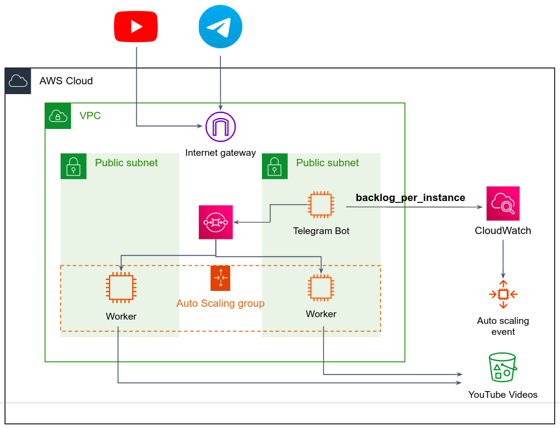

# AWS Ex1 - Extend the YouTube Telegram Bot

**Can be done in pairs (highly recommended)**.

## Background

Your goal is to provision the YouTube Telegram Bot in a scalable and durable architecture in AWS.

In the [The PolyBot](https://github.com/alonitac/PolyBot) repo, review `microservices` branch. This branch contains the following services:
1. `bot.py` - the Telegram bot you've implemented in the previous exercise. But this time, the bot doesn't download the videos itself, but sends the "job" to an SQS queue.

2. `worker.py` - the worker service continuously reads messages from the queue and process them, which means download the video from YouTube and store it in a dedicated bucket in S3.

Here is a high level of the bot-workers microservices architecture:

As you can see, the Telegram messages are served by the Bot service. All it does is sending a message to an SQS queue, so the Bot is a very lightweight service that can serve requests very quickly. From the other side, there are Workers that consume messages from the queue and do the hard work - to download the video from youtube and upload it to S3. The workers are part of an AutoScaling group. The group is scaled in and out by a custom metric that the Bot service writes to CloudWatch. You can call the metric `BacklogPerInstance` as it represents the number of messages in the queue (messages that was not consumed yet) per instance. For example, assume you have 5 workers up and running, and 100 messages in the queue, thus `BacklogPerInstance` equals 20, since each worker instance has to consume ~20 messages to get the queue empty. For more information, [read here](https://docs.aws.amazon.com/autoscaling/ec2/userguide/as-using-sqs-queue.html).

## Guidelines

1. Create a VPC with at least 2 public subnets.

2. Create an S3 bucket which will store the uploaded youtube videos

3. Create an SQS standard queue. Messages that was not processed yet should reside in the queue for a maximum period of 4 days. The worker has a maximum period of 30 minutes to process a single message.

4. Create a Launch Template and an AutoScaling Group. Keep the default configurations, we will change it later. **The Minimum and Desired capacity of the ASG should be zero**.   

5. You are given most of the code for the bot and worker services. In branch `microservices` complete the following *TODO*s:
   1. In `worker.py` complete the implementation of `process_msg()` function such that the downloaded videos will be uploaded to S3 (you can delete them from the disk afterwards). 
   2. In `utils.py` complete `calc_backoff_per_instance()` such that the value of variable `backoff_per_instance` will be sent as a metric to [CloudWatch](https://boto3.amazonaws.com/v1/documentation/api/latest/guide/cw-example-metrics.html#publish-custom-metrics).
   3. Change `config.json` according to your resources in AWS.  

    Except the above two changes, you don't need to change the code (unless you want to add more functionality to the service).

6. After you've implemented the code changes, it is good idea to test everything locally. Run the `bot.py` service and a single worker `worker.py`. Make sure that when you send a message via Telegram, the Bot service produces a message to the SQS queue, and the Worker consumes the message, downloads the YouTube video and uploads it to S3. 

7. Deploy the Worker service to an EC2 instance (you can run it as a container the same way you did in the last exercise). Create an AMI from that instance and base your Launch Template on that AMI. 

8. Deploy the Bot service on a single EC2 instance (this service is not part of the autoscaling group). It should be very similar to the deployment you've done in the previous exercise - in a docker container that restarts automatically on OS reboot.

9. Use AWS cli to create a [target tracking scaling policy](https://docs.aws.amazon.com/autoscaling/ec2/userguide/as-using-sqs-queue.html#create-sqs-policies-cli) in your Autoscaling Group. `MetricName` and `Namespace` should correspond to the metric your Bot service is firing to CloudWatch. Give the `TargetValue` some value that you can test later (e.g. 10, which means if there are more than 10 messages in the SQS queue, a scale up event wil trigger). 

10. Make sure your services are given restrictive IAM role permissions. 

11. Test your application under load. 

## Submission 

Present you work in a personal meeting (usually 20 minutes before our bi-weekly class). **Final due date is 31/08/22**.

# Good Luck

Don't hesitate to ask any questions